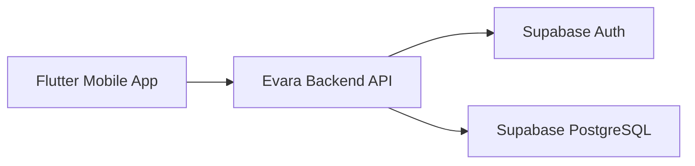

# Evara Backend

Backend service for Evara, a family finance management application built with Go and Supabase.

## Overview

Evara Backend provides RESTful APIs for user authentication, family management, invitations, and transaction management. The backend uses Supabase for authentication and database services, while business logic is implemented in Go.

## Features

### Authentication

* Login with Supabase Authentication
* Retrieve authenticated user information

### Family Management

* Create Family
* Get My Family
* Get Family Members

### Invitation Management

* Invite Family Members
* Get Invitations
* Accept Invitation
* Reject Invitation

### Transaction Management

* Create Transaction
* Get Transactions

## Tech Stack

### Backend

* Go (Golang)
* REST API

### Database & Authentication

* Supabase
* PostgreSQL

### Infrastructure

* Environment-based configuration
* JWT Authentication via Supabase

---

## Architecture



---

## Project Structure

```text
.
│├── handlers/
│├── middleware/
│└── models/
├── configs/
├── pkg
├── .env
└── main.go
```

---

## Prerequisites

Before running the project, make sure you have:

* Go 1.22+ (or your current version)
* Supabase Project
* Git

---

## Installation

### Clone Repository

```bash
git clone https://github.com/RizkyMlana/evara-backend.git

cd evara-backend
```

### Install Dependencies

```bash
go mod tidy
```

### Configure Environment Variables

Create a `.env` file:

```env
SUPABASE_URL=your_supabase_url
SUPABASE_JWT_SECRET=your_supabase_jwt_secret_key
DATABASE_URL=your_database_url

PORT=8000
```

### Run Application

```bash
go run main.go
```


---

## API Endpoints

### Authentication

| Method | Endpoint | Description            |
| ------ | -------- | ---------------------- |
| POST   | /login   | Login user             |
| GET    | /me      | Get authenticated user |

### Family

| Method | Endpoint               | Description        |
| ------ | ---------------------- | ------------------ |
| POST   | /families              | Create family      |
| GET    | /families/me           | Get my family      |
| GET    | /families/{id}/members | Get family members |

### Invitations

| Method | Endpoint                 | Description       |
| ------ | ------------------------ | ----------------- |
| POST   | /invitations             | Invite member     |
| GET    | /invitations             | Get invitations   |
| POST   | /invitations/{id}/accept | Accept invitation |
| POST   | /invitations/{id}/reject | Reject invitation |

### Transactions

| Method | Endpoint      | Description        |
| ------ | ------------- | ------------------ |
| POST   | /transactions | Create transaction |
| GET    | /transactions | Get transactions   |

---

## Environment Variables

| Variable                  | Description               |
| ------------------------- | ------------------------- |
| SUPABASE_URL              | Supabase project URL      |
| SUPABASE_JWT_SECRET_KEY   | Supabase anonymous key    |
| DATABASE_URL              | Supabase Database URL |
| PORT                      | Application port          |

---

## Roadmap

### Completed

* [x] Authentication
* [x] Family Management
* [x] Invitation Management
* [x] Transaction Management

### Planned

* [ ] Expense Categories
* [ ] Budget Management
* [ ] Monthly Reports
* [ ] Push Notifications
* [ ] Recurring Transactions
* [ ] Family Roles & Permissions

---

## API Documentation

API documentation is currently under development.

Future releases may include Swagger/OpenAPI documentation.


---

## Author

Developed for the Evara ecosystem.
